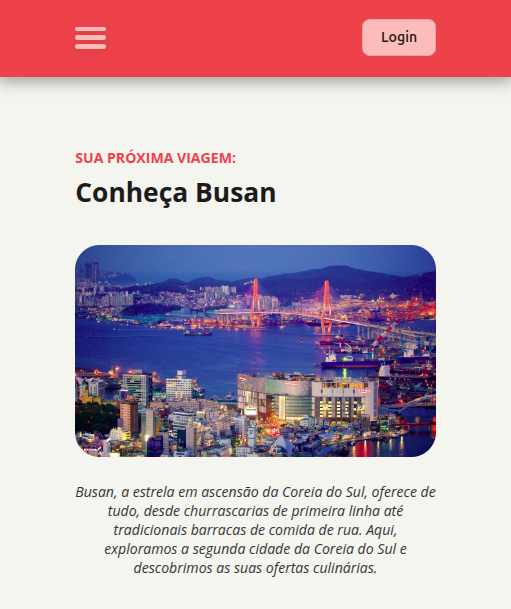

# Conheça Busan
**Explore Busan como nunca antes!** Neste projeto de landing page com temática de blog, mergulhamos na cultura, nos sabores e na energia dessa cidade litorânea que conquista corações - da comida de rua autêntica aos restaurantes mais renomados da Coreia do Sul.

O projeto é **totalmente responsivo**, garantindo uma ótima experiência em qualquer dispositivo, e conta com uma **estrutura HTML semântica**, priorizando acessibilidade e boas práticas de desenvolvimento web.

## 💻 Layout
<div align="center">
  
</div>

## 🔧 Linguagens
 - HTML
 - CSS

## 🤖 Clonar repositório

1. Clone o repositório:
```bash
  git clone https://github.com/CaioAlves10/fullstack-nivel-03-local-turistico.git
```

2. Entre no diretório:
```bash
  cd fullstack-nivel-03-local-turistico
```

<br />

---

<br />

<p align="center">
  Feito com 💙 por Caio Carvalho
</p>